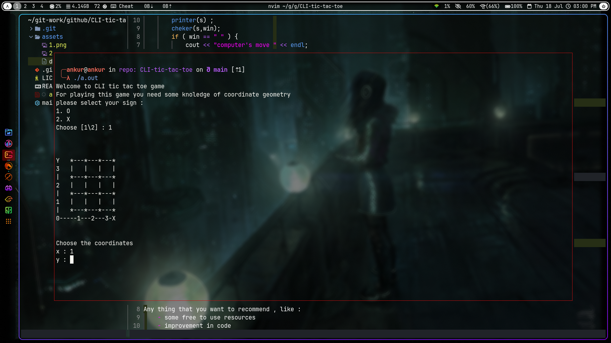
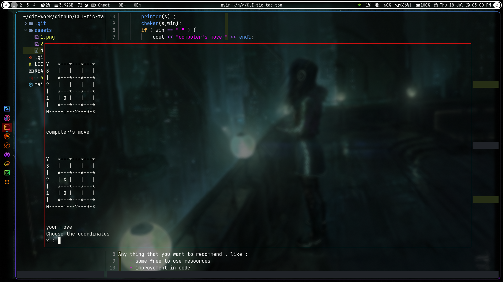

# CLI tic tac toe
This is just an experiment ground
where basically I will do anything and experiment with this repo a lot,
as much as I can .

## Current state :
This is how it looks ATM

## To do's :
    - learn how to use cmake and implement it here

### Advices and contributions are welcomed
If you are a person who want to suggest me then feel free to do that.
Any thing that you want to recommend , like :
    - some free to use resources
    - improvement in code
    - a better way to implement something
    - or any other thing

#### License
[MIT](LICENSE)
